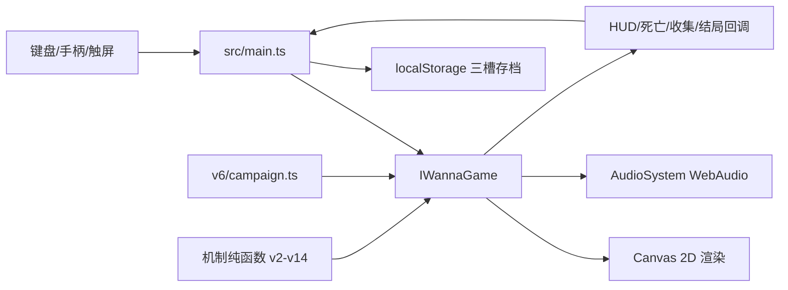

# 《失忆乐园》AI 继续开发交接书

> 当前基线：v12.7.0 · 递进闯关版
> 正式仓库：<https://github.com/liuzhanrui30-boop/lost-memory-park>  
> 在线版本：<https://liuzhanrui30-boop.github.io/lost-memory-park/>

这份文档让新的开发者或 AI 无需依赖聊天记录即可继续开发。仓库已经包含全部 TypeScript、HTML、CSS、测试、构建脚本、浏览器验收脚本、设计文档和可直接游玩的单文件版本；没有未上传的图片、音频或服务端源码。游戏画面由 Canvas 程序绘制，音乐和音效由 WebAudio 程序生成。

## 1. 五分钟启动

```bash
git clone https://github.com/liuzhanrui30-boop/lost-memory-park.git
cd lost-memory-park/source
npm ci
npm test
npm run dev
```

Node.js 22 或更新版本。生产构建：

```bash
npm run build
```

输出：

- `source/dist/index.html`：Vite 构建入口。
- `source/dist/lost-memory-park.html`：CSS、JS 和游戏内容全部内嵌的离线单文件。

## 2. 当前产品状态

| 项目 | 当前实现 |
|---|---|
| 视角 | 2D 横版 Canvas；角色运动锁定二维平面 |
| 美术 | 非像素纸雕/黏土玩具舞台，全部程序绘制 |
| 输入 | 键盘、手柄、手机横屏多点触控 |
| 内容 | 1 序章 + 24 普通房间 + 4 Boss + 1 终章 |
| 递进 | 每章 6 关；每关 4 个明确段落 |
| 收藏 | 12 段核心记忆、员工档案、多个结局 |
| 存档 | 浏览器 localStorage 三槽，可导入导出 JSON |
| 网络 | 游戏运行不依赖网络、服务器或账号 |
| 测试 | 28 个单元测试文件、103 项测试，加 3 组真实浏览器验收 |
| 发布 | 根目录单文件 + GitHub Actions 自动部署 Pages |

### 已明确删除、不要恢复

- 冲刺；
- 玩家攻击；
- 记忆锚点与记忆回溯；
- 随机传送门；
- 跳过 Boss 阶段；
- 险过连拍；
- 舞台热度。

旧存档里的热度/连拍字段只为兼容读取保留，不得重新写入或显示。

## 3. 架构与状态流



### 状态所有权

- `source/src/main.ts`：DOM 菜单、存档槽、设置、触控桥接和 `IWannaGame` 生命周期。
- `source/src/v2/IWannaGame.ts`：玩家、房间、碰撞、机关、Boss、摄影机、粒子和绘制的唯一运行时状态所有者。
- `source/src/v6/campaign.ts`：正式战役房间生成、章节顺序和机制配方。
- `source/src/v2/types.ts`：房间、实体、存档、输入与回调合同。
- 其他 `v*` 目录：尽量无副作用的机制、规则和回归测试。

不要在 `main.ts`、DOM 或新模块中复制玩家位置、死亡、Boss 阶段等运行时状态。需要 UI 数据时，通过现有回调或 Debug snapshot 暴露只读数据。

## 4. 源码地图

| 路径 | 作用 |
|---|---|
| `source/index.html` | 全部菜单、HUD、设置和手机触控 DOM |
| `source/src/style.css` | 桌面/手机 UI、舞台框架、响应式和安全区 |
| `source/src/main.ts` | 应用入口、存档、设置、屏幕切换、输入映射 |
| `source/src/game/AudioSystem.ts` | WebAudio 音乐层、音效和音频生命周期 |
| `source/src/v2/IWannaGame.ts` | 核心循环、物理、碰撞、渲染、房间运行时 |
| `source/src/v2/types.ts` | 核心数据结构 |
| `source/src/v2/rooms.ts` | 基础房间数据与校验 |
| `source/src/v3/kinematics.ts` | 运动学和平台承载计算 |
| `source/src/v3/mechanics.ts` | 通用机关时序 |
| `source/src/v3/boss-patterns.ts` | Boss 弹幕模式 |
| `source/src/v6/campaign.ts` | 30 场景战役构建 |
| `source/src/v6/stage-mechanics.ts` | 舞台机关与段落机制 |
| `source/src/v6/stage-render.ts` | 世界段落标记绘制 |
| `source/src/v7/hardcore-mechanics.ts` | 追逐、瞄准和高压规则 |
| `source/src/v9/action-locks.ts` | 七种可见动作验证锁 |
| `source/src/v10/projectile-patterns.ts` | 远程投射物模式 |
| `source/src/v11/boss-stage.ts` | Boss 阶段推进门槛 |
| `source/src/v12/stable-camera.ts` | 固定背景与摄影机死区 |
| `source/src/v12/render-quality.ts` | 桌面/手机内部画布策略 |
| `source/src/v12/touch-ui.ts` | 触控显示策略和尺寸计算 |
| `source/src/v13/echo-management.ts` | 死亡残影命中、删除和安全过滤 |
| `source/src/v14/progression.ts` | 六关压力阶梯、段落角色、检查点层级 |
| `source/src/v15/level-safety.ts` | 按钮安全区、动态危险扫掠和关卡可达性校验 |
| `source/qa/` | CDP 浏览器端到端与性能验收 |

## 5. 当前关卡语法

每章固定六关：

1. **入门：** 单个核心机制，低远程压力，无追逐。
2. **练习：** 两个机制分开使用，增加第一座炮台。
3. **组合：** 两个机制首次同时出现，加入第二层执行要求。
4. **变化：** 在已学机制上改变节奏、空间或方向。
5. **考核：** 两座炮台与完整动作锁，要求稳定执行。
6. **终局：** 章节机制总考，加入可读追逐，之后进入 Boss。

每个普通房间固定四段：

1. `learn` / 学习
2. `practice` / 练习
3. `test` / 考验
4. `finish` / 终点

检查点通过不同外形、颜色、段落名称和 `N/总数` 显示进度。新增房间必须遵守这个语法，除非用户明确要求重新设计整个递进系统。

## 6. 物理与手感合同

- 固定 60Hz 时间步长。
- 支持土狼时间、跳跃缓冲、松键短跳和二段跳。
- 移动平台必须正确承载玩家并传递有限动量。
- 单向平台用 `S/↓` 或手机下穿键离开。
- 重生点需要安全区，不能重生即死。
- 摄影机采用水平死区；背景不随玩家产生明显视差晃动。
- 失败残影没有实体碰撞。
- 任何按钮触碰框都不得与静止、移动或轨道尖刺、激光及压台机扫掠范围重叠。

修改参数前阅读 `docs/03-移动物理与碰撞.md`，并更新对应运动学测试。

## 7. 存档兼容

存档保存在 localStorage，核心接口在 `source/src/v2/types.ts` 和 `source/src/main.ts`。

修改存档结构时：

1. 新字段必须有默认值。
2. 旧字段不得直接假定存在。
3. 在规范化/迁移函数中处理旧版本。
4. 导入失败应显示错误而不是破坏当前槽。
5. 不改变已经获得的章节、收藏和结局进度。

## 8. 测试与验收

快速测试：

```bash
cd source
npm test
npm run build
```

完整发布校验：

```bash
npm run release:pages
npm run qa:browser
```

`npm run qa:browser` 会自动启动预览和无头 Chrome，验证：

- 24 个房间的六级/四段结构；
- 已删除系统不会回归；
- 手机横屏多点触控、滑动换向和下穿；
- 桌面/手机内部画布；
- 高压房间平均帧率与 P99。

浏览器也提供 `?debug=1`，全套 API 记录在 `docs/07-测试调试与性能.md`。

## 9. 发布与实时更新

正式发布命令：

```bash
cd source
npm run release:pages
cd ..
git add -A
git commit -m "描述本次修改"
git push origin main
```

推送 `main` 后：

1. GitHub Actions 安装锁定依赖；
2. 运行全部测试；
3. 进行 TypeScript 和生产构建；
4. 校验根 `index.html` 与源码构建完全一致；
5. 上传构建产物；
6. 自动更新 GitHub Pages 永久链接。

如果流水线失败，不要绕过测试直接上传旧 HTML。先查看 Actions 日志，修复后再次推送。

## 10. 新 AI 接手时的建议步骤

1. 运行 `git status`，确认工作区状态。
2. 阅读 `AGENTS.md`、本文件和 `docs/project-state.json`。
3. 运行 `cd source && npm ci && npm test && npm run build` 建立干净基线。
4. 在源码而非根 `index.html` 中定位任务。
5. 修改最小的状态所有者，并补充测试。
6. 运行 `npm run release:pages`。
7. 有 Chrome 时运行 `npm run qa:browser`。
8. 更新文档与 `CHANGELOG.md`。
9. 只推送个人仓库 `liuzhanrui30-boop/lost-memory-park`。
10. 验证公开网址已经显示新版本。

## 11. 当前后续方向

没有必须立即修复的已知阻塞项。后续开发应优先来自真实试玩反馈，建议顺序：

1. 逐关记录死亡位置，识别不公平或无意义的死亡峰值。
2. 在不增加隐藏积分系统的前提下，丰富每章独有的可见机关组合。
3. 改善 Boss 的视觉预警与阶段差异，而不是增加纯弹幕数量。
4. 继续优化低端手机热降频和 Canvas 阴影成本。
5. 新内容必须保持清晰递进、快速重开和可复盘死亡。
