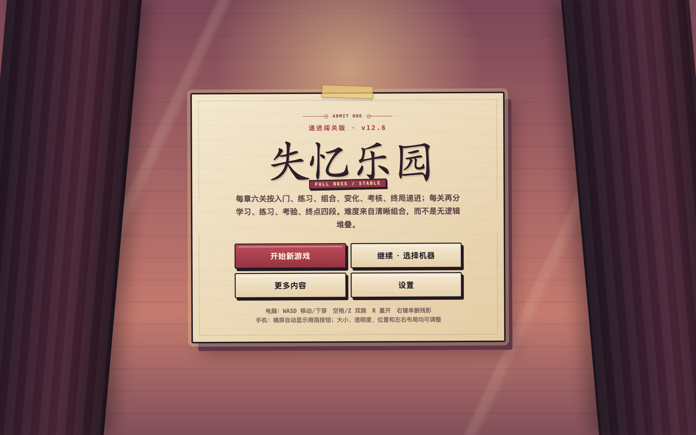
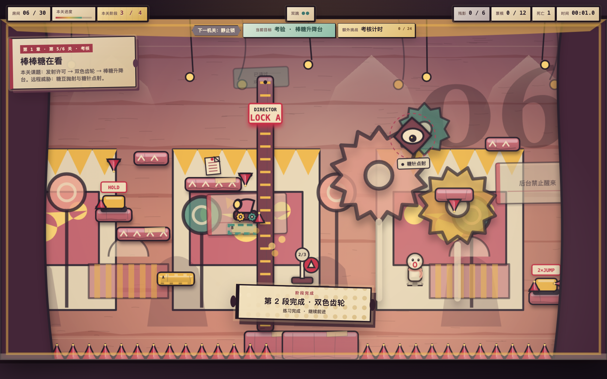
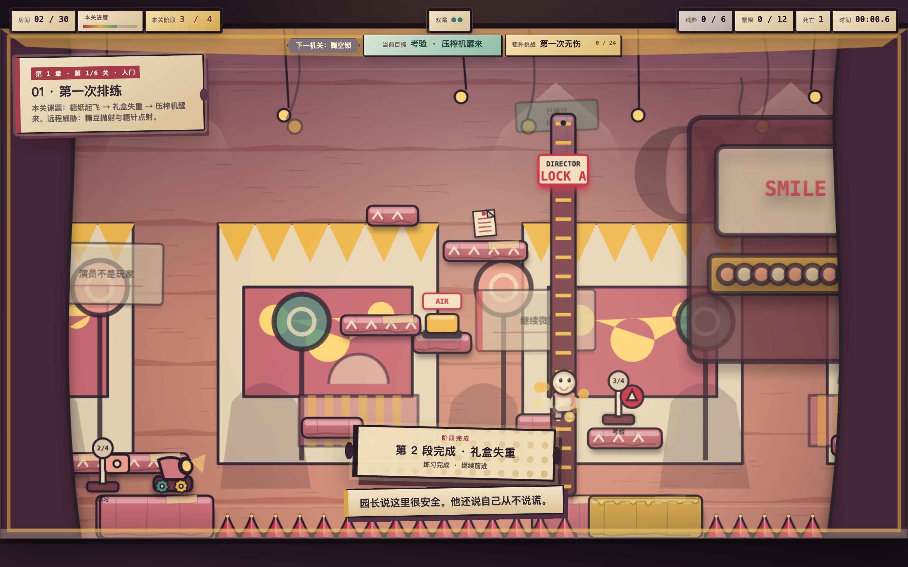
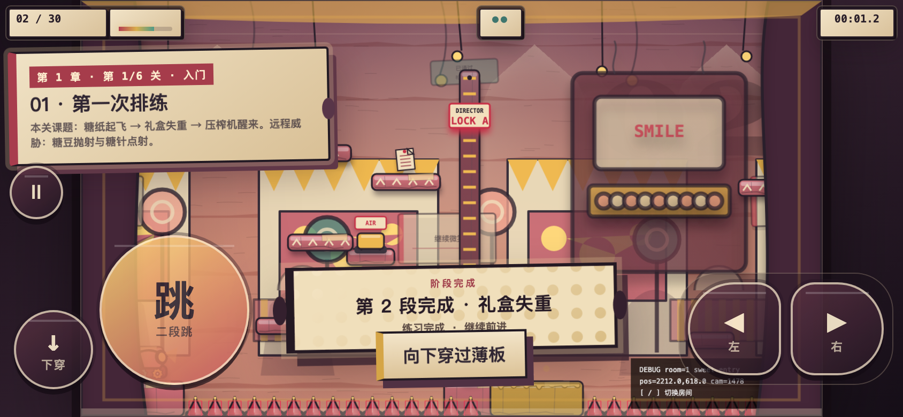
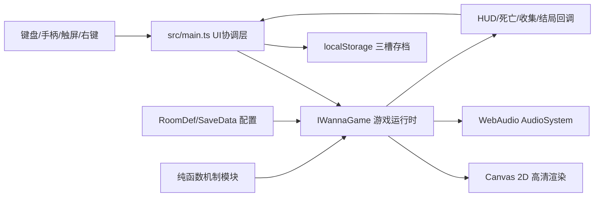

# 失忆乐园 · 递进闯关版 v12.9.1

> 原创非像素、纯跑跳、高难度横版网页游戏。纸雕/黏土玩具舞台美术，融合反套路陷阱、平台跳跃、动作验证锁、远程弹幕、四阶段宽关卡和完整 Boss 战。

[](https://liuzhanrui30-boop.github.io/lost-memory-park/)


## 立即游玩

**永久公开地址：** <https://liuzhanrui30-boop.github.io/lost-memory-park/>

**备用入口：** <https://liuzhanrui30-boop.github.io/lost-memory-park/play.html>










根目录的 [`index.html`](index.html) 是已经内嵌 CSS、JavaScript 与全部游戏内容的离线单文件版本。下载后双击即可运行，不需要服务器、账号或联网资源。

## 完整源码与 AI 继续开发

仓库已经公开保存游戏的**全部可编辑源码**，包括 TypeScript、HTML、CSS、关卡数据、WebAudio、单元测试、浏览器验收、构建脚本和从设计到部署的完整文档。美术和声音均由代码生成，因此不存在只留在作者电脑、没有上传的外部素材工程。

- [AI 开发入口 `AGENTS.md`](AGENTS.md)
- [AI 继续开发交接书 `AI_HANDOFF.md`](AI_HANDOFF.md)
- [机器可读项目状态 `docs/project-state.json`](docs/project-state.json)
- [参与开发与验收规则 `CONTRIBUTING.md`](CONTRIBUTING.md)

新的 AI 或开发者克隆仓库后可直接执行：

```bash
cd source
npm ci
npm test
npm run dev
```

推送 `main` 后，GitHub Actions 会自动测试、重新构建并更新永久游玩链接；不需要手工上传网页。

## 一句话介绍

玩家控制失去颜色与记忆的白色纸偶，在由“笑脸园长”管理的失控游乐园中，只依靠移动、双跳、下穿薄板与快速重开，通过会欺骗玩家的舞台机关，找回 12 段核心记忆并决定乐园的结局。

## 玩家承诺

- **手感明确：** 操作只有移动、双跳、下穿和重开，但每个动作都可精确控制。
- **死亡有信息：** 陷阱可以恶作剧，但预警、节奏或复盘信息必须足够让玩家学会。
- **关卡高压但清晰：** 每章六关依次为入门、练习、组合、变化、考核、终局；关内四段依次为学习、练习、考验、终点。
- **没有隐藏积分负担：** 已删除“险过连拍”和“舞台热度”；评级与额外挑战只使用时间、死亡和明确规则。
- **原创舞台感：** 不使用像素风，也不复制任何商业游戏的角色、素材或具体关卡。
- **离线可保存：** 单文件运行，本地三存档槽，无服务器依赖。
- **电脑手机同版：** 桌面保留高清键盘/手柄体验，手机横屏自动切换安全区双拇指触控与稳定画布配置。

## 操作

| 操作 | 默认按键 | 说明 |
|---|---|---|
| 向左/向右 | `A/D`、`←/→` | 地面加速、空中修正 |
| 跳跃 | `空格`、`Z`、`W`、`↑` | 支持二段跳与松键短跳 |
| 下穿薄板 | `S`、`↓` | 从单向薄板向下离开 |
| 快速重开 | `R` | 回到最近检查点 |
| 单删残影 | `鼠标右键` | 只删除指针点中的一具死亡残影 |
| 清空残影 | `Backspace` | 清空全部死亡残影并回到检查点 |
| 暂停 | `Esc` | 暂停模拟与音频 |

手机/平板横屏进入游戏后会自动显示左右移动、下穿、跳跃和暂停按钮。方向区支持按住滑动换向，移动与跳跃可多点同时按下；设置中可以调整自动显示/始终显示/关闭、方向键大小、跳跃键大小、透明度、底部距离与左右手布局。

> 当前正式规则中没有冲刺、攻击、记忆锚点或回溯技能。关卡只靠移动、双跳和下穿薄板完成。

## v12.8 流畅性与障碍修复

- 碰撞移动改为无临时数组的固定步热路径，减少浏览器 GC 卡顿。
- 粒子效果设有硬上限，触发连锁机关时不会无限堆积。
- 高 DPI 和手机低端设备自动启用轻量绘制细节，保留清晰轮廓与可读预警。
- 新增尖刺扫掠路径与平台/锁墙/支路的系统校验；动态尖刺不会穿过实体障碍。

## v12.9.1 聚光灯调优与入口稳定化

- 每个序章、普通房间、Boss 和终章都拥有明确的故事节点：说话者、关键线索和当前目标。
- 四章剧情按“我是设计师 → 乐园是服从实验 → 园长是执行人格 → 记忆决定醒来方式”递进，不再只依赖零散档案句子。
- 房间卡会短暂显示剧情台词，暂停目标同步显示当前剧情目标；Boss 不跳阶段的规则也与台词一致。
- 结局文本改为解释玩家行为造成的结果，区分逃离、接管、摧毁和带着记忆生活。

## 当前内容规模

| 内容 | 数量/规则 |
|---|---|
| 场景 | 30 个：1 序章 + 24 普通房间 + 4 Boss + 1 终章 |
| 普通房间 | 每关 3440×720，四段连续结构，两道动作验证锁 |
| 章节递进 | 每章 6 关：入门、练习、组合、变化、考核、终局 |
| 关内递进 | 每关 4 段：学习、练习、考验、终点 |
| 章节 | 糖果迎宾区、失控马戏团、镜像鬼屋、梦境城堡 |
| 核心记忆 | 12 段，决定三种主结局 |
| 隐藏结局 | 集齐全部核心记忆与全部员工档案后可选择 |
| 结局 | 逃离、接管、摧毁、带着记忆生活 |
| Boss | 4 位，每位 3 阶段；必须躲满规定攻击波才能解锁机关 |
| 模式 | 故事、计时挑战、Boss Rush、镜像、导演失控 |
| 存档 | 3 个本地槽位，可导入/导出 JSON |
| 自动测试 | 29 个测试文件，107 项测试 |
| 浏览器验收 | 递进结构、手机触控、性能 3 组真实 Chrome 验收 |
| 按钮安全 | 所有静止、移动和轨道尖刺的扫掠范围都不得进入按钮触碰区 |

## 双端画质与性能

v12.8 延续按设备使用两档明确的内部画布，不让浏览器盲目按 Retina 倍率无限增加填充量：

- 普通窗口内部画布至少 **1600×900**。
- 1920×1080 及以上窗口使用最高 **1920×1080** 内部画布。
- 手机横屏使用 **1280×720** 内部画布；在常见 844×390 CSS 视口中仍属于超采样显示，同时显著降低移动 GPU 压力。
- 舞台背景、世界布景、前景幕布均使用与主画布相同分辨率的缓存。
- 平台渐变、尖刺折面、角色头身光影与舞台灯光完整保留。
- 固定 60Hz 模拟；视野外对象裁剪；粒子/投射物上限；HUD 15Hz 差量更新。
- 暂停页与标题页降到 10Hz 绘制，避免多个页面在后台持续占用资源。
- v12.8 最终高压房间继续以 60 FPS 为验收门槛；该数字来自本机自动化浏览器，真实表现仍取决于设备。

## 仓库结构

```text
.
├── index.html                 # GitHub Pages 与离线游玩的单文件正式版
├── README.md                  # 项目入口与快速说明
├── AGENTS.md                  # 所有 AI 必须遵循的仓库规则
├── AI_HANDOFF.md              # 当前状态、架构与继续开发交接书
├── LICENSE                    # MIT 代码许可证
├── CONTRIBUTING.md            # 修改、测试与提交规范
├── CHANGELOG.md               # 版本变化记录
├── docs/                      # 从设计到部署的完整中文文档
│   ├── 01-游戏设计文档-GDD.md
│   ├── 02-技术架构.md
│   ├── 03-移动物理与碰撞.md
│   ├── 04-关卡陷阱与Boss设计.md
│   ├── 05-叙事美术与音频.md
│   ├── 06-数据存档UI与输入.md
│   ├── 07-测试调试与性能.md
│   ├── 08-从零到一开发教程.md
│   ├── 09-发布部署与维护.md
│   ├── 10-代码导读与扩展.md
│   └── project-state.json     # 机器可读当前状态
├── .github/workflows/         # PR 验证与 GitHub Pages 自动部署
└── source/                    # 完整可构建 TypeScript 源码
    ├── index.html
    ├── package.json
    ├── package-lock.json
    ├── tsconfig.json
    ├── vite.config.ts
    ├── vitest.config.ts
    ├── scripts/
    ├── qa/                    # 真实浏览器验收与性能脚本
    └── src/
```

## 本地开发

需要 Node.js 22 或更新版本。

```bash
cd source
npm ci
npm run dev
```

Vite 会给出本地地址。修改代码后运行：

```bash
npm test
npm run build
npm run qa:browser
```

构建产生：

- `source/dist/index.html`：标准 Vite 入口。
- `source/dist/lost-memory-park.html`：CSS 与 JavaScript 全部内嵌的离线单文件。

将正式构建同步到仓库根目录：

```bash
cd source
npm run release:pages
```

然后提交根目录 `index.html` 即可更新 GitHub Pages。

完整发布建议直接运行 `npm run release:pages`；该命令会依次执行测试、类型检查、生产构建、单文件生成、根页面同步和 SHA-256 一致性校验。推送 `main` 后，Actions 流水线会再次执行相同质量门并自动部署。

## 文档导航

1. [游戏设计文档 GDD](docs/01-游戏设计文档-GDD.md)：玩家承诺、循环、章节、模式、结局与验收标准。
2. [技术架构](docs/02-技术架构.md)：系统边界、状态所有权、更新顺序、渲染管线。
3. [移动物理与碰撞](docs/03-移动物理与碰撞.md)：全部手感参数、碰撞算法与边缘规则。
4. [关卡、陷阱与 Boss](docs/04-关卡陷阱与Boss设计.md)：六关递进、四段结构、动作锁、机关词汇与难度规则。
5. [叙事、美术与音频](docs/05-叙事美术与音频.md)：世界观、四章视觉语言、Canvas 绘制和 WebAudio。
6. [数据、存档、UI 与输入](docs/06-数据存档UI与输入.md)：核心接口、存档迁移、设置与设备输入。
7. [测试、调试与性能](docs/07-测试调试与性能.md)：106 项测试、Debug API、双端性能预算和回归流程。
8. [从零到一开发教程](docs/08-从零到一开发教程.md)：从空目录到可发布游戏的完整制作顺序。
9. [发布、部署与维护](docs/09-发布部署与维护.md)：单文件、GitHub Pages、itch.io 与版本发布。
10. [代码导读与扩展](docs/10-代码导读与扩展.md)：按文件阅读源码，添加房间、机关、模式与成就。

## 核心架构概览



## 设计与实现原则

1. **数据与运行时分离。** 房间、机关、Boss、存档使用显式 TypeScript 接口。
2. **可测试机制优先。** 摄影机、动作锁、碰撞辅助、Boss 波数、弹幕模式均拆成纯函数。
3. **单一状态写入者。** `IWannaGame` 持有运行时状态；`main.ts` 只处理 DOM、菜单和持久化。
4. **固定步长。** 所有物理按 1/60 秒更新，不把显示器刷新率直接当作物理时间。
5. **先清晰再恶作剧。** 陷阱可以突然变化，但不得依赖不可读、永久卡死或重生即死。
6. **源码与发布物并存。** 玩家可直接打开根目录游戏，开发者可在 `source/` 复现构建。

## 原创性与许可

- 游戏角色、剧情、关卡数据、Canvas 绘制、美术风格和 WebAudio 音色均为本项目原创实现。
- 项目只借鉴高难平台游戏的抽象类型：精准跑跳、误导陷阱、快速重开；不包含其他作品的角色、图像、音乐、地图或商标素材。
- 代码采用 [MIT License](LICENSE)。如果用于公开项目，请保留许可证和原项目说明。

## 当前状态

v12.9 是可在电脑与手机横屏完整游玩、可离线运行、可公开分享的版本。它在 v12.8 的流畅碰撞和障碍安全基础上，为序章、24 个普通房间、4 个 Boss 与终章补齐了连续可读的剧情节点。未来方向记录在 GDD 的“开放问题与后续范围”中；未写入当前范围的多人、服务器排行榜、云存档和商业付费系统不属于当前实现。
