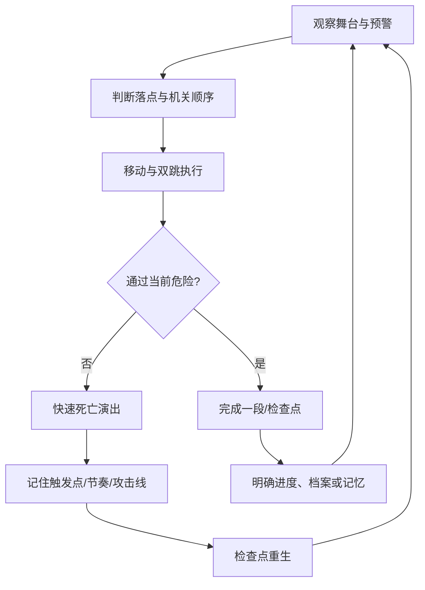

# 01 · 游戏设计文档（GDD）

> 文档状态：对应 v12.7 实际实现。本文是设计、程序、关卡、叙事和 QA 的共同事实来源；与旧设想冲突时，以当前代码和本文为准。

## 1. 产品定义

### 1.1 游戏名称

《失忆乐园》（Lost Memory Park）。名称可替换，不影响技术结构。

### 1.2 类型

- 2D 横版高难平台跳跃。
- 单人、离线、章节制连续冒险。
- 反套路陷阱 + 精准跑跳 + 环境机关解题。
- 浏览器游戏，桌面键盘优先。

### 1.3 目标玩家

1. 喜欢精准平台跳跃、反复练习和快速重开的玩家。
2. 喜欢观看主播被陷阱“设计”并产生节目效果的观众。
3. 喜欢短流程、多结局、收集叙事的独立游戏玩家。

### 1.4 目标时长

- 首次完整故事：30–45 分钟以上，取决于平台游戏熟练度。
- 熟练速通：10–15 分钟目标区间。
- Boss Rush、镜像和导演模式提供重复游玩。

## 2. 玩家承诺与设计支柱

### 2.1 玩家承诺

“每次死亡都让我更懂舞台；每次成功都来自我的判断和操作，而不是角色数值。”

### 2.2 五个设计支柱

#### 支柱 A：极简输入，复杂决策

正式玩法只有左右移动、跳跃/二段跳、下穿单向薄板和快速重开。复杂度来自落点、节奏、诱导、攻击线、动作锁和路线选择，而不是技能栏。

#### 支柱 B：恶作剧必须可学习

陷阱允许突然出现、假装安全或改变节奏，但必须满足至少一项：

- 预警可见；
- 首次死亡后规律固定；
- 危险区域有视觉语言；
- 重生距离足够近；
- 存在明确躲避窗口。

#### 支柱 C：高压但清晰

同一章节使用统一远程攻击语言；每章六关按入门、练习、组合、变化、考核、终局递进，每个房间再按学习、练习、考验、终点四段展开。镜头横向稳定，背景不随角色晃动。难度来自已教学机制的逐步组合，而不是界面混乱或无逻辑堆叠。

#### 支柱 D：失败也是舞台内容

死亡使用压扁、拆散、弹飞、纸偶残影等玩具化黑色幽默，不使用写实血腥。死亡残影可以成为空间提示与临时踏板，最多保留 6 个；导演模式可能限制为 3 个。

#### 支柱 E：原创非像素舞台

使用纸雕、黏土玩具、手绘剧场的矢量 Canvas 语言。所有内容原创，不复制其他平台游戏的角色、音乐、贴图、地图或商标。

## 3. 核心循环

### 3.1 秒级循环

观察预警 → 移动/起跳 → 空中修正 → 落地/触发机关 → 躲避攻击。

### 3.2 分钟级循环

完成学习、练习、考验、终点四段 → 解两道动作锁 → 到达出口 → 获得评级与记录 → 下一房间。

### 3.3 章节循环

六个普通房间学习并组合章节机制 → 三阶段 Boss 检验 → 新章节改变美术、攻击与关卡语法。

### 3.4 全局循环

收集 12 段核心记忆与员工档案 → 解锁结局、成就和额外模式 → 重玩以提高评级、完成悬赏、记录最佳残影。

## 4. 操作与角色规则

### 4.1 输入

- 左右：控制水平加速度和空中修正。
- 跳跃：地面/土狼时间一跳；空中可二段跳。
- 松开跳跃：提前削减向上速度，形成短跳。
- S/下方向：向下穿过当前单向薄板。
- R：立即死亡并返回检查点。
- 鼠标右键：只删除点中的一具死亡残影。
- Backspace：清除全部残影并返回检查点。
- Esc：暂停。
- 手机横屏：左右区、下穿键、跳跃键和暂停键；方向区可按住后滑动换向，支持移动与跳跃同时触发。

### 4.2 明确不包含

- 不攻击敌人。
- 不冲刺。
- 不使用抓钩、墙跳、滑铲。
- 不使用记忆锚点或回溯。
- 不通过随机传送门跳过内容。
- 不允许跳过 Boss 阶段。

### 4.3 失败与重生

- 接触尖刺、激光、弹幕、压榨机、追逐幕墙等致命危险立即死亡。
- 死亡动画约 0.2 秒，随后在最近检查点恢复。
- 章节、核心记忆、员工档案和历史最佳不会因死亡丢失。
- 重生会重置临时机关、Boss 当前阶段攻势与局部压力系统。
- 重生前自动删除与复活安全矩形重叠的残影，避免残影实体将角色挤入墙体；路线其他位置的残影保留。

## 5. 关卡结构

### 5.1 总结构

| 区段 | 内容 |
|---|---|
| 序章 | 1960 像素宽，场景内按键牌，并教学基础尖刺、大炮、追逐幕墙、抛射哨兵和压榨机 |
| 第 1 章 | 6 普通房间 + 糖果 Boss |
| 第 2 章 | 6 普通房间 + 马戏 Boss |
| 第 3 章 | 6 普通房间 + 镜像 Boss |
| 第 4 章 | 6 普通房间 + 园长 Boss |
| 终章 | 结局选择与统计 |

### 5.2 普通房间四段模板

1. **学习段。** 展示本关主要机制，给出可读的基础组合。
2. **练习段。** 让玩家在更长路线中重复主要机制。
3. **考验段。** 加入动作锁与本关第二层组合。
4. **终点段。** 混合本关已出现机制、章节远程攻击和高风险档案支路。

每个普通房间：

- 世界宽度固定为 3440。
- 四个带 `SegmentRole` 的 `BeatDefinition` 段落标记。
- 两道动作验证锁。
- 至少三个分段检查点。
- 两道动作锁之后的检查点直接立在恢复平台顶面，玩家正常落地即可触发。
- 远程攻击器与章节攻击主题一致。
- 传送门数组为空。

### 5.3 动作验证锁

支持七种要求：助跑、腾空、反向、静止、二段跳、上升、下坠。锁的目标是验证玩家是否理解动作状态，而不是要求额外按键或隐藏积分。

### 5.4 悬赏合同

每个普通房间有可选合同，失败不阻挡通关。规则类型：

- 无死亡；
- 限时；
- 地面不能静止过久。

合同完成会记录导演封印，作为高水平重复游玩目标。

## 6. 四章内容

| 章节 | 视觉主题 | 远程攻击 | 主要机制 | 玩家学习目标 |
|---|---|---|---|---|
| 糖果迎宾区 | 奶油纸张、糖果机器、礼盒巨口 | 糖豆抛射、糖针点射 | 黏性台、假台、隐藏刺、大炮、压榨机 | 不相信表面安全，学习预警与落点 |
| 失控马戏团 | 红幕、聚光灯、弹床、大炮 | 飞刀扇射、马戏连炮 | 弹床、静止聚光灯、移动台、双色舞台 | 在节奏与攻击线之间切换动作 |
| 镜像鬼屋 | 冷色镜面、双影、相位舞台 | 镜像双发、倒影狙击 | 冰面、相位台、轨道台、真假路线 | 控制惯性，识别视觉误导 |
| 梦境城堡 | 齿轮、熔炉、城墙、园长机器 | 齿轮连射、王冠散射 | 输送带、激光、崩塌城墙、混合机关 | 综合执行前三区机制 |

## 7. Boss 规则

- 四个章节 Boss，每个默认 3 阶段。
- 当前阶段先生成确定性的攻击波。
- 第 1、2 阶段需要躲过 2 波；更高阶段最多要求 3 波。
- 攻击波达标后，当前阶段按钮才允许推进。
- 死亡重置当前阶段攻击波进度，但保留已经完成的 Boss 阶段。
- Boss 攻击模式按章节变化，包含点射、抛射、扇射、镜射和连射。

### Boss 验收标准

- 未达到波数时触碰按钮不得跳阶段。
- 达到波数后按钮只推进一个阶段。
- 阶段顺序不可逆，不可一次完成多个阶段。
- 重生不能直接落入攻击物。
- 所有阶段存在可重复通过的安全窗口。

## 8. 进度、收集与结局

### 8.1 核心记忆

12 段核心记忆构成主线真相。获得后永久写入当前存档槽。

### 8.2 员工档案

可选文本收集物，通常放在高风险支路。全部获得后，与 12 段核心记忆共同解锁隐藏结局选择。

### 8.3 结局阈值

| 条件 | 结局 |
|---|---|
| 0–5 核心记忆 | 逃离结局 |
| 6–11 核心记忆 | 接管结局 |
| 12 核心记忆 | 摧毁乐园真结局 |
| 12 核心记忆 + 全部员工档案 + 终章隐藏方向 | 带着记忆生活 |

## 9. 模式

### 故事模式

完整章节、收集、剧情与结局。

### 计时挑战

记录全局时间与最佳成绩；仍使用相同动作规则。

### Boss Rush

连续挑战四位 Boss，要求先完成故事模式解锁。

### 镜像模式

输入映射与画面镜像，房间结构不变，考验动作记忆。

### 导演失控

每个房间由固定种子选择一种导演指令：轻飘舞台、催场、停电演出、热刺反应或演员限额。相同种子与房间得到相同规则，保证可复现。

## 10. UI 与可访问设置

- 标题、继续、槽位、章节、模式、档案、制作信息。
- HUD：房间、本关进度、当前阶段与目标、跳跃次数、残影、核心记忆、死亡、时间、动作锁和额外挑战。
- 设置：主音量、音乐、音效、环境、震动、闪光、粒子、动态背景、高对比、粗轮廓、文字大小、HUD 模式、按键绑定、手柄、触屏自动/开/关、方向键与跳跃键大小、触控透明度、底部距离、左右手布局、颜色友好、预警增强、游戏速度。
- 开启降低速度、预警增强或显示隐藏陷阱会标记为辅助通关。

## 11. 难度规则

1. 单纯一直向右必须在所有普通房间短时间内死亡。
2. 每个检查点后的第一处危险必须给玩家反应时间。
3. 同屏危险数量可多，但必须区分前景、平台、攻击线和 UI 层级。
4. 远程攻击每章只使用有限词汇，不在单关混入全部模式。
5. 随机只允许改变可复现导演规则，不允许随机删除可通关窗口。
6. 高难路线奖励档案、评级或合同，不强迫普通玩家完成全部收集。

## 12. 内容验收标准

### 玩法

- 角色不穿墙、不无限下落、不被移动平台甩入墙体。
- 头顶边角存在最多 6 像素修正。
- 跳跃缓冲和土狼时间稳定生效。
- R 重开在 0.2 秒级别完成反馈。

### 关卡

- 24 个普通房间都有四段和两道锁，每章课程序号连续为 1–6。
- 无传送门。
- 所有检查点安全。
- 所有房间出口位于世界范围内。
- Boss 阶段不可跳过。

### 进度

- 刷新页面后存档恢复。
- 核心记忆与档案不会因死亡丢失。
- 四个结局条件正确。
- 三槽位互不覆盖。

### 浏览器

- 失去焦点、隐藏页面时暂停并静音。
- 恢复焦点后只有在未显示暂停/设置/结局界面时恢复音频。
- 窗口缩放保持 16:9，不裁切 HUD。
- 1600×900–1920×1080 高清画布不造成明显卡顿。
- 手机横屏按钮避开安全区，移动与跳跃可同时按下；竖屏给出明确旋转提示。
- 手机内部画布保持 1280×720，触控取消、切后台和失焦后不得残留卡键。

## 13. 已决定事项

- 免费、无广告、无账号、无服务器。
- 简体中文，无配音。
- 电脑键盘优先，手机横屏自动启用触屏；手柄和触屏模式都可在设置中调整。
- 第一版包含完整主线、四结局和额外模式。
- 不包含多人、云存档、在线排行榜、关卡编辑器和付费系统。

## 14. 开放问题与未来范围

以下不是 v12.7 承诺，只作为后续评估：

- 是否为极低性能手机增加可选 30 FPS 节能模式，而不改变当前默认 60 FPS 规则。
- 是否将 `IWannaGame` 进一步拆分为 Physics、Hazard、Progression、Renderer 子系统。
- 是否加入官方录像分享，而不是服务器排行榜。
- 是否增加完全原创的第五章，而不是继续堆叠当前四章机制。
