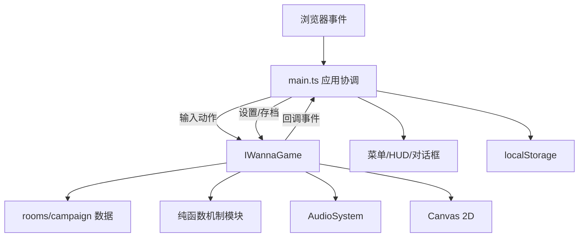
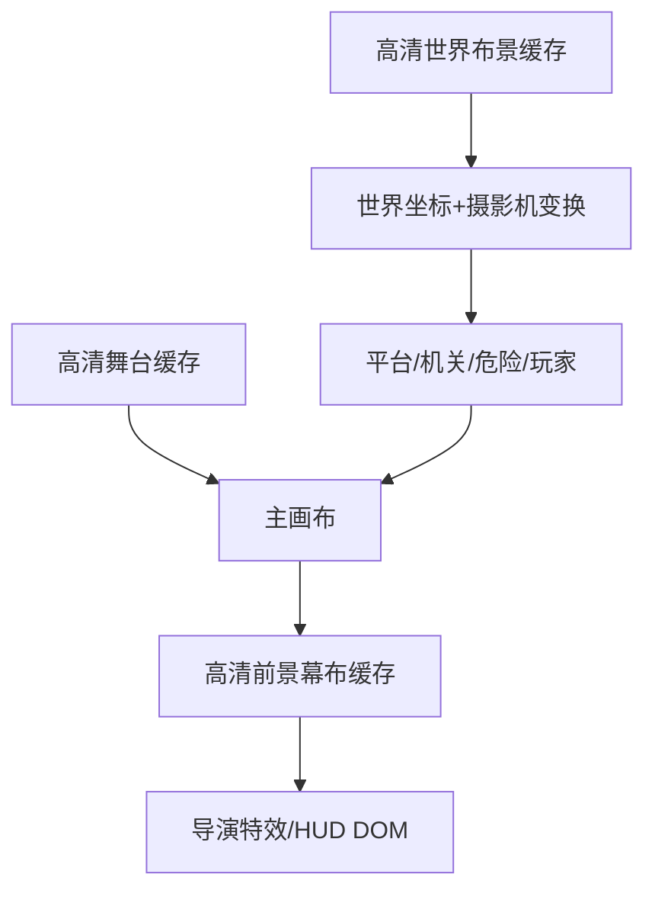
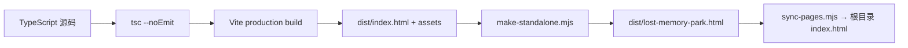

# 02 · 技术架构

## 1. 技术栈

- Vite 6：开发服务器与生产构建。
- TypeScript：strict 模式、ES2022。
- HTML5 Canvas 2D：全部游戏画面。
- WebAudio：程序化音乐与音效。
- Vitest：机制、数据和回归测试。
- localStorage：三槽本地存档。
- GitHub Pages：静态公开部署。

没有第三方物理引擎、渲染引擎、服务端或外部素材请求。

## 2. 系统边界



### `src/main.ts`

负责：

- DOM 查询和菜单切换；
- 键盘、手柄、触屏事件转为统一动作；
- 存档读取、规范化、迁移和写入；
- HUD 差量更新；
- 对话、档案、结局和设置页面；
- 页面失焦/隐藏时暂停音频与模拟；
- Debug API 暴露。

不负责物理碰撞、陷阱判定和 Canvas 游戏画面。

### `src/v2/IWannaGame.ts`

当前游戏运行时与唯一主要状态写入者。负责：

- 房间加载与对象运行时副本；
- 固定步长循环；
- 角色运动与碰撞；
- 陷阱、机关、弹幕、Boss、合同与收集；
- 摄影机；
- Canvas 绘制；
- 通过回调将结果发送给 UI 层。

该类较大，是当前架构的主要技术债务；扩展新大型系统时应优先拆分，而不是继续加入双向依赖。

### 数据模块

- `v2/types.ts`：所有数据契约。
- `v2/rooms.ts`：基础房间与数据校验。
- `v3/remix.ts`：早期宽关卡扩展。
- `v6/campaign.ts`：24 套四幕房间、动作锁、合同、攻击主题和序章/Boss 升级。

### 纯函数机制模块

| 文件 | 职责 |
|---|---|
| `v3/kinematics.ts` | 分段运动、头顶修正、平台支撑、平台动量 |
| `v3/mechanics.ts` | 相位、轨道、风力 |
| `v3/boss-patterns.ts` | Boss 弹幕生成 |
| `v4/art-direction.ts` | 四章色板、颜色明暗、稳定视觉随机数 |
| `v6/stage-mechanics.ts` | 大炮、压榨机、聚光灯、崩塌台、幕奖励 |
| `v7/hardcore-mechanics.ts` | 追逐速度、瞄准、预判、合同、连击、擦弹 |
| `v9/action-locks.ts` | 八类动作锁判定与文案 |
| `v10/projectile-patterns.ts` | 点射、抛射、扇射、镜射、连射 |
| `v11/boss-stage.ts` | Boss 攻击波门槛 |
| `v12/stable-camera.ts` | 固定背景、死区摄影机、轻震动 |
| `v12/render-quality.ts` | 1.25–1.5 高清内部画布比例 |

## 3. 状态所有权

| 状态 | 唯一写入者 | 持久化 |
|---|---|---|
| 玩家位置、速度、跳跃、死亡 | `IWannaGame` | 否，检查点位置会保存 |
| 当前房间机关运行状态 | `IWannaGame` | 部分 Boss 阶段保存 |
| 核心记忆、档案、成就、结局 | `IWannaGame` | `V2Save` |
| 菜单开关与当前页面 | `main.ts` | 否 |
| 三槽存档数组 | `main.ts` | localStorage |
| 音频节点与循环 | `AudioSystem` | 仅设置值保存 |
| 房间定义 | 数据模块 | 源码静态配置 |

原则：UI 不直接修改运行时内部数组；运行时不直接操作菜单 DOM。

## 4. 固定步长循环

```text
requestAnimationFrame(now)
  1. 计算 delta，最大限制为 0.05 秒
  2. active 时累加 accumulator
  3. accumulator >= 1/60：update(1/60 × gameSpeed)
  4. draw()
  5. 暂停/标题状态只每 100ms draw 一次
```

固定步长避免 60Hz、120Hz 和 144Hz 显示器产生不同跳跃高度或碰撞结果。

## 5. 单帧更新顺序

1. 更新时间、缓冲、连击、震动和粒子。
2. 死亡状态只等待重生。
3. 更新移动平台、相位、陷阱运行状态。
4. 更新 Boss 与压力系统。
5. 应用风力。
6. 读取方向输入并计算水平速度。
7. 处理跳跃缓冲、土狼时间和二段跳。
8. 应用重力。
9. 分段执行 X 碰撞。
10. 分段执行 Y 碰撞和平台承载。
11. 检查压力伤害、机关、尖刺、激光、Boss 弹幕。
12. 检查检查点、收集物和出口。
13. 更新热度、合同、最佳残影与摄影机。
14. 以最多 15Hz 发送 HUD 回调。

此顺序的目的：移动先完成，再做伤害与触发判定；摄影机最后读取已稳定的玩家位置。

## 6. 渲染管线



### 三层缓存

1. **Stage cache：** 天空、纸纹、远景、灯具、固定幕布。
2. **Scenery cache：** 世界宽度内的招牌、大型章节装置和地标。
3. **Foreground cache：** 暗角、左右帷幕、顶部装饰、底部纸边。

缓存尺寸使用与主画布相同的 `dpr`，避免高分辨率主画布放大低清缓存。

### 动态绘制

仅绘制摄影机左右 150 像素扩展范围内的对象。平台、尖刺、按钮、激光、弹幕、玩家和粒子保持矢量路径，以确保移动时清晰。

## 7. 高清比例

`preferredRenderScale()` 根据窗口比例选择：

- 最低 1.25：1280×720 逻辑画面对应 1600×900 backing canvas。
- 最高 1.5：对应 1920×1080。
- 大于全高清的 Retina/4K 显示器不继续无限增长，以控制填充率和缓存内存。
- 窗口缩放触发 `resize()`，必要时重建主画布和三层缓存。

## 8. 事件接口

`V2Callbacks` 是运行时到 UI 的单向接口：HUD、房间进入、Toast、死亡、保存、记忆、档案、成就、房间评级、合同、幕完成、模式完成和结局。

优点：

- 机制测试不需要真实 DOM；
- UI 可替换而不改变物理；
- 存档写入时机集中可追踪。

## 9. 构建流程



`make-standalone.mjs` 读取 Vite 生成的 JS/CSS，将其内嵌到 HTML，得到无外链单文件。

## 10. 扩展点

### 添加纯机制

优先新增独立模块和测试，再由 `IWannaGame` 调用。例如新的周期机关应先实现 `stateAt(time, config)`。

### 添加关卡内容

只修改数据与房间生成器，不应在主循环写 `if(room.id===...)` 的特殊规则。

### 添加模式

扩展 `V2Save['mode']`、标题入口、`startMode()` 初始化和完成条件。模式修改应通过明确的规则对象，不应散落全类。

### 拆分类建议

未来可将 `IWannaGame` 拆为：

- `Simulation`：固定步长与角色物理；
- `HazardSystem`：陷阱、弹幕与伤害；
- `ProgressionSystem`：收集、合同、评级、结局；
- `WorldRenderer`：Canvas 绘制与缓存；
- `CameraSystem`：摄影机状态。

## 11. 架构风险

1. `IWannaGame` 同时承担模拟与渲染，修改时需要较大回归范围。
2. 房间运行时副本依赖对象展开，新增嵌套可变字段时要避免共享引用。
3. 单文件体积随内容增长；当前约 200KB，仍在安全范围。
4. Canvas 阴影在部分低端浏览器可能走慢速路径，应持续测量。
5. localStorage 容量有限，最佳残影采样需保持压缩和长度上限。
