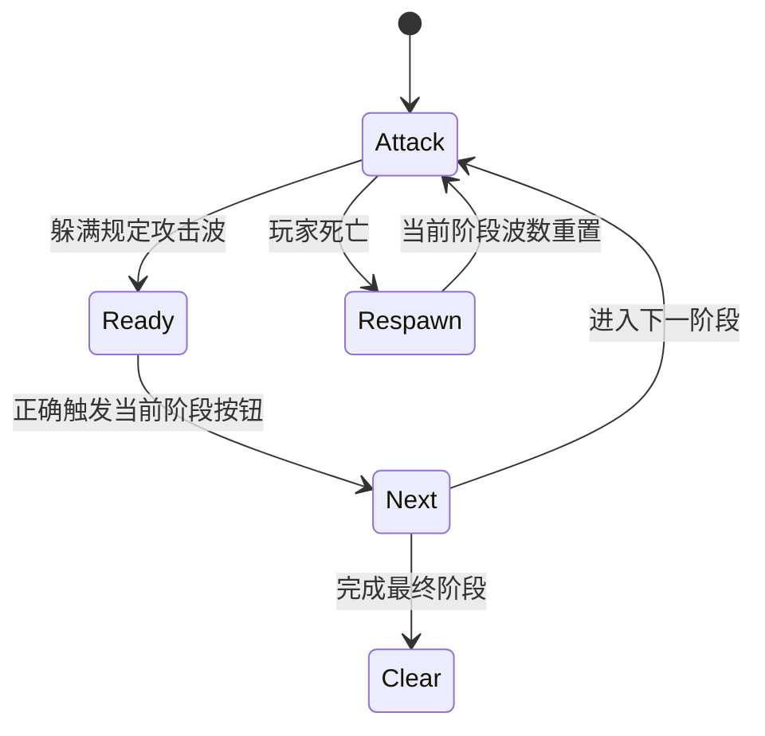

# 04 · 关卡、陷阱与 Boss 设计

## 1. 关卡设计目标

- 高难度来自需要读招、规划和精确执行，而不是单纯把尖刺铺满地面。
- 每关路线连续清晰，不使用不明传送门。
- 每一章有固定远程攻击语言，玩家能把上一关学到的阅读能力带到下一关。
- 普通路线必须可完成；高风险支路提供档案、合同和更高评级。
- “一直按右”不能成为有效策略。
- 必经落点可以窄，但不能把下穿薄板、极限回跳或尸体搭路当作未教学的强制解法。

## 2. 六关递进与四段房间语法

普通房间宽 3440，使用四段与三个主要检查点。每章的六个普通房间还使用固定压力阶梯：

| 关卡 | 定位 | 远程炮台 | 执行机关 | 终点段危险 |
|---|---|---:|---|---|
| 1 | 入门 | 0 | 不加入 | 单一章节机关 |
| 2 | 练习 | 1 | 不加入 | 单一章节机关 |
| 3 | 组合 | 1 | 前半加入 | 一层附加危险 |
| 4 | 变化 | 1 | 前半加入 | 一层附加危险 |
| 5 | 考核 | 2 | 前后半完整加入 | 完整终点组合 |
| 6 | 终局 | 2 + 追逐 | 前后半完整加入 | 完整终点组合 |

### 第 1 段：学习

- 安全位置看到主要机关。
- 第一组攻击给完整预警。
- 允许玩家用较低风险理解机制。

### 第 2 段：练习

- 将主要机关与一种执行脚本组合。
- 加入移动高度、弹幕线或假平台。
- 第一次明显提高动作密度。

### 第 3 段：考验

- 第一/第二道动作锁通常出现在这一阶段前后。
- 玩家必须以要求状态触发按钮，而不是普通触碰。
- 错误触发提供文字/音效反馈，不直接永久封路。
- 锁后设置 104 像素宽的恢复薄板，存档旗底边贴合平台顶面；从主路线落地时立即触发。

### 第 4 段：终点

- 组合章节攻击与本关机制。
- 提供高路或危险支路档案。
- 出口前最后一组危险需要完整执行，但检查点距离合理。

## 3. 机关词汇

### 平台类

- `solid`：普通实体平台。
- `moving`：往返移动平台。
- `fake`：道具假台，可被陷阱移动或掉落。
- `bounce`：弹床，改变垂直速度。
- `ice`：低摩擦冰面。
- `oneway`：单向平台。
- `conveyor`：输送带。
- `phase`：周期实体平台。
- `crumble`：踩踏后预警、消失、恢复。
- `toggle`：A/B 双色切换平台。
- `sticky`：限制水平速度的糖浆台。
- `orbit`：椭圆轨道平台。
- `gate`：动作锁或 Boss 阶段门。

### 危险类

- 四方向尖刺；可隐藏、移动或轨道运动。
- 周期激光；支持水平/垂直方向。
- 压榨机；带预警、危险和冲击状态。
- 静止聚光灯；亮起时移动会受罚。
- 追逐幕墙；根据与玩家距离调整速度。
- 导演哨兵；发射点射、抛射、扇射、镜射或连射。
- Boss 弹幕；按章节与阶段确定性生成。

### 环境类

- 大炮发射器。
- 风区。
- 段落标记与当前目标提示。
- 核心记忆、员工档案、检查点、出口。
- 12 种大型舞台地标。
- 序章 `TutorialSignDef` 新手指示牌。

## 4. 陷阱数据

`TrapDefinition` 包含：

- `trigger`：触发矩形；
- `action`：reveal/drop/slide/launch；
- `targets`：目标实体 ID；
- 运行时 `triggered` 集合保证一次性触发；
- 房间重置时恢复。

### 陷阱公平性检查

每个陷阱必须回答：

1. 玩家在哪个位置第一次触发？
2. 触发后到危险生效有多少时间？
3. 玩家可向哪里躲？
4. 第一次死亡后能否理解原因？
5. 重生点是否在触发区域外？
6. 多个机关同时运行时是否仍有安全窗口？

### 按钮安全区

- 每个按钮碰撞框向四周扩展 6 像素作为不可侵入区。
- 静止尖刺使用实体矩形检查；移动尖刺使用完整往返范围；轨道尖刺使用整个椭圆包围盒。
- 激光实体范围和压台机完整运动范围同样不能进入按钮安全区。
- 生成关卡发现冲突时移除冲突危险，并同步删除陷阱中已经不存在的目标 ID。
- 小坑优先放在跑道起跳边缘或两平台间隙，禁止把危险直接盖在交互中心。

## 5. 动作锁

| 要求 | 判定 |
|---|---|
| touch | 普通触碰 |
| airborne | 当前不在地面 |
| reverse | 水平速度小于 -70 |
| still | 落地且水平速度绝对值小于 35 |
| double-jump | 空中且已使用至少两次跳跃计数 |
| momentum | 落地且水平速度绝对值至少 275 |
| rising | 空中且 `vy <= -180` |
| falling | 空中且 `vy >= 180` |

锁必须在附近提供足够空间建立状态。例如助跑锁前必须有跑道；下坠锁上方必须有安全起跳台。

## 6. 章节设计

### 第 1 章：糖果迎宾区

**主题：** 表面友善、内部咬人。

- 糖豆抛射与糖针点射。
- 黏性糖浆、假礼盒、隐藏尖刺、逆向大炮、压榨机。
- 地标：糖果压榨机、棒糖齿轮、礼盒巨口。

关卡教学顺序：预警 → 假安全 → 平台状态变化 → 远程攻击与落点组合。

### 第 2 章：失控马戏团

**主题：** 舞台要求玩家按节拍表演。

- 飞刀扇射与马戏连炮。
- 弹床、移动台、静止聚光灯、掌声舞台、双色切换。
- 地标：大炮塔、掌声之眼、活幕布。

教学顺序：弹跳节奏 → 光照规则 → 多方向攻击 → 舞台切换。

### 第 3 章：镜像鬼屋

**主题：** 视觉信息与运动惯性发生冲突。

- 镜像双发与倒影狙击。
- 冰面、相位台、轨道台、错误倒影、真假出口视觉。
- 地标：破镜、双生阴影、旋转房间。

教学顺序：惯性 → 相位时机 → 轨道落点 → 多层视觉误导。

### 第 4 章：梦境城堡

**主题：** 园长将前三章机制工业化。

- 齿轮连射与王冠散射。
- 输送带、激光、崩塌城墙、压榨机、混合机关。
- 地标：钟表巨手、记忆焚化炉、选择机器。

教学顺序：组合复习 → 高压连锁 → 精确动作锁 → 最终综合演出。

## 7. 远程攻击模式

### 点射 aimed

单发直接瞄准。用于建立“看到预警线就换位”的基础。

### 抛射 arc

速度略降低、初始向上并受 390 重力影响。玩家需要预测落点而不是只躲直线。

### 扇射 fan

以 -0.18/0/+0.18 弧度发射三枚，制造扇形封锁但保留间隙。

### 镜射 mirror

以 ±0.105 弧度双发，中间可能是安全线，也可能迫使玩家移动。

### 连射 burst

沿同方向以 0.76/1/1.24 倍速度连续三枚，惩罚保持单一节奏。

## 8. 追逐幕墙

- 玩家进入 triggerX 后启动。
- 速度在 baseSpeed 与 maxSpeed 间变化。
- 离玩家越远可适度追赶；接近时仍需保留操作窗口。
- 幕墙本身占据整屏高度，避免穿越。
- 追逐路线上不放要求长时间等待的机关。

## 9. Boss 设计

### 结构

### 波数规则

`min(3, 2 + floor(phase / 2))`：早期阶段 2 波，后期最多 3 波。

### Boss 公平性

- 攻击生成确定性，不因刷新率变化。
- 预警阶段不造成伤害。
- 按钮 UI 显示当前攻势计数。
- 只有当前阶段按钮有效。
- Boss 造型与弹幕不能遮挡角色脚下关键落点。

## 10. 难度曲线

| 阶段 | 主要压力 |
|---|---|
| 序章 | 识别发射、追逐和大范围压榨 |
| 第 1 章前半 | 单一陷阱与基础远程攻击 |
| 第 1 章后半 | 假平台、黏性与压榨组合 |
| 第 2 章 | 节奏、弹跳和静止条件 |
| 第 3 章 | 惯性、相位和视觉误导 |
| 第 4 章 | 多系统组合与密集攻击线 |
| Boss | 读招耐力 + 机关顺序 |

难度提高方式优先级：

1. 增加需要观察的攻击线；
2. 缩小但不消灭安全窗口；
3. 组合两种已教学机制；
4. 延长连续执行段；
5. 最后才增加尖刺密度。

v12.7 延续 72–104 像素的必经精确平台与动作锁后的呼吸落点，并进一步把并发压力按每章六关逐级释放：第一关不放炮台，第五关才进入完整双炮台与双执行机关。所有按钮周围保留不可侵入的触碰区；新增小坑只放在跑道起跳边缘或两个平台之间，并使用糖牙、飞刀、镜像轨道和钟表红线四种章节语法。

## 11. 关卡数据验收

自动校验包括：

- 出生、出口、检查点和收集物不越界；
- 实体 ID 唯一；
- 哨兵参数合法；
- 追逐触发点位于世界内；
- 段落标记按 X 递增；
- 普通房间世界宽度、四段、双锁和无传送门要求；
- 每章六关必须拥有 1–6 的连续课程序号与固定难度名称；
- 出口有可站立支撑；
- 检查点与危险保持安全距离。
- 两道动作锁恢复平台顶部必须存在可直接触发的检查点。
- 序章必须包含标明 W、S/下穿和残影管理的新手指示牌。

## 12. 人工试玩清单

- 只按右是否会在 0.7 秒左右遇到致命障碍。
- 第一次看到攻击时能否分辨预警和实体弹丸。
- 死亡后是否知道下一次该改变什么。
- 检查点是否过密导致难度消失，或过疏导致重复劳动。
- 从高墙或上层路线落下时，检查点是否被单向平台挡住；正常落地能否直接存档。
- 高风险档案是否可选而非主路强制。
- 同屏 UI 是否挡住关键平台。
- 章节之间的视觉和攻击语言是否明显切换。
